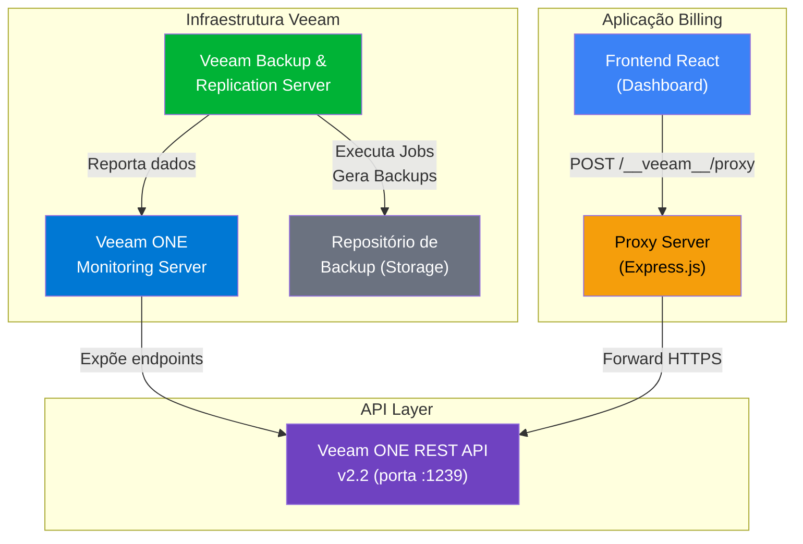
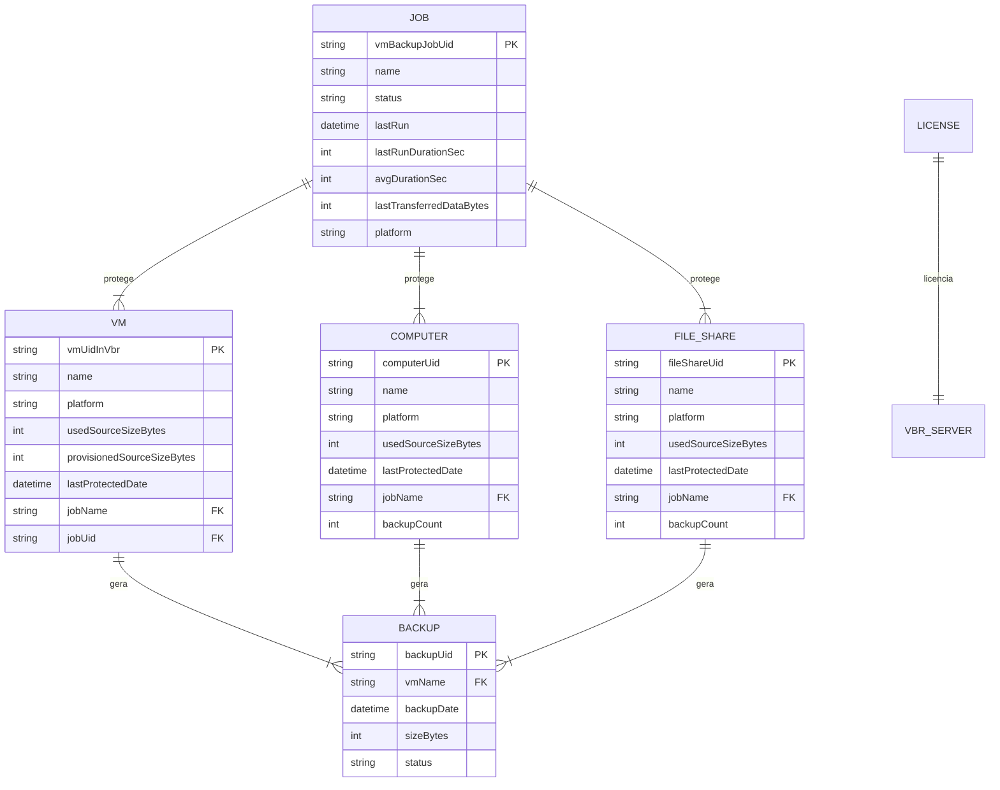
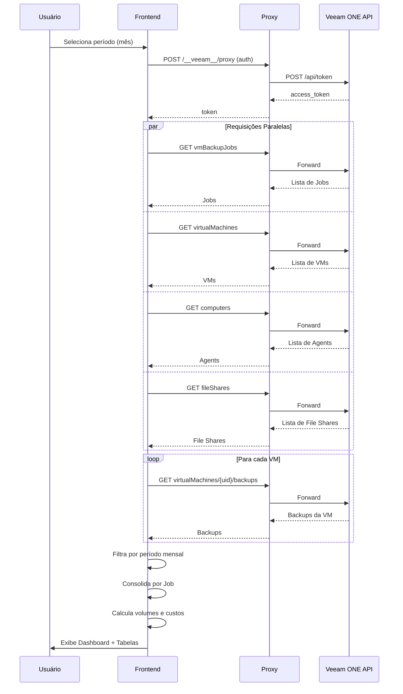
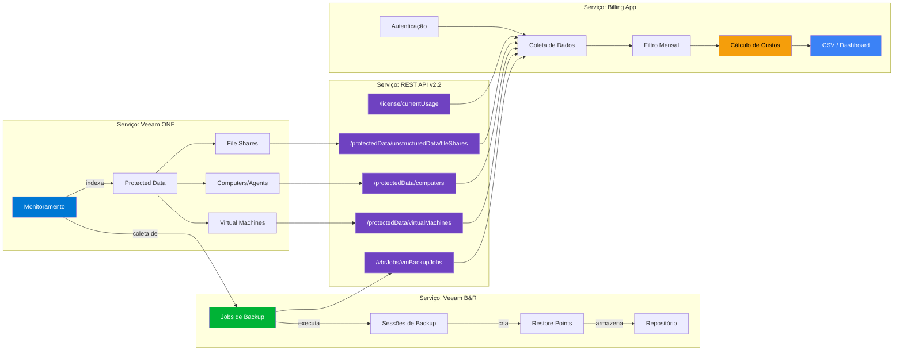

# Relatório: Informações de Backup de VMs por Mês

## Visão Geral

Este relatório detalha como obter, interpretar e relacionar as informações de backup de máquinas virtuais (VMs) por mês no ecossistema **Veeam**, utilizando a **REST API v2.2 do Veeam ONE** e a aplicação **veeam-billing-app**.

---

## 1. Arquitetura dos Serviços Envolvidos



### Descrição dos Serviços

| Serviço | Função | Porta/Protocolo |
|---------|--------|-----------------|
| **Veeam Backup & Replication (VBR)** | Executa os jobs de backup, cria pontos de restauração e gerencia a retenção | Interno |
| **Veeam ONE** | Monitora o VBR, coleta métricas e disponibiliza dados via API REST | HTTPS `:1239` |
| **REST API v2.2** | Camada de acesso programático ao Veeam ONE para consultar jobs, VMs, backups, licenciamento | `/api/v2.2/*` |
| **Proxy Server (Express)** | Contorna CORS e certificados auto-assinados entre o navegador e a API Veeam | HTTP `:3000` |
| **Frontend (React/Vite)** | Dashboard visual com gráficos, tabelas e exportação CSV | HTTP `:3000` |

---

## 2. Relacionamento entre as Entidades



### Hierarquia de Relacionamento

1. **Job → Workloads**: Um Job de backup protege uma ou mais VMs, Computadores (Agents) ou File Shares
2. **Workloads → Backups**: Cada workload gera múltiplos backups (pontos de restauração) ao longo do tempo
3. **License → Server**: O licenciamento VUL (Veeam Universal License) controla quantas instâncias podem ser protegidas

---

## 3. Endpoints da API para Consulta Mensal

### 3.1 Autenticação

```
POST /api/token
Content-Type: application/x-www-form-urlencoded

grant_type=password&username={usuario}&password={senha}
```

Retorna um `access_token` (Bearer) utilizado em todas as chamadas subsequentes.

---

### 3.2 Jobs de Backup de VMs

```
GET /api/v2.2/vbrJobs/vmBackupJobs?skip=0&limit=1000
Authorization: Bearer {token}
```

**Campos principais retornados:**

| Campo | Descrição | Uso no Relatório |
|-------|-----------|------------------|
| `name` | Nome do Job | Agrupamento |
| `status` | Success / Warning / Failed | Saúde do backup |
| `lastRun` | Data/hora da última execução | **Filtro por mês** |
| `lastRunDurationSec` | Duração da última execução | Desempenho |
| `lastTransferredDataBytes` | Dados transferidos | Volume mensal |
| `platform` | VMware / Hyper-V | Classificação |

> [!IMPORTANT]
> O filtro por mês é feito **no cliente**: a API retorna todos os jobs, e o app filtra por `lastRun` entre o primeiro e último dia do mês selecionado.

---

### 3.3 VMs Protegidas

```
GET /api/v2.2/protectedData/virtualMachines?skip=0&limit=1000
Authorization: Bearer {token}
```

| Campo | Descrição |
|-------|-----------|
| `vmUidInVbr` | ID único da VM (usado para buscar backups) |
| `name` | Nome da VM |
| `usedSourceSizeBytes` | Tamanho real dos dados da VM |
| `provisionedSourceSizeBytes` | Tamanho provisionado |
| `lastProtectedDate` | Data do último backup |
| `jobName` | Nome do Job que protege esta VM |

---

### 3.4 Backups de uma VM Específica

```
GET /api/v2.2/protectedData/virtualMachines/{vmUid}/backups?skip=0&limit=1000
Authorization: Bearer {token}
```

| Campo | Descrição |
|-------|-----------|
| `uid` | ID do backup |
| `creationTime` | Data de criação do backup |
| `sizeBytes` | Tamanho do backup |
| `status` | Status do backup |

> [!TIP]
> Para obter informação por mês, filtre `creationTime` entre `YYYY-MM-01` e `YYYY-MM-último_dia`.

---

### 3.5 Computadores (Agents)

```
GET /api/v2.2/protectedData/computers?skip=0&limit=1000
GET /api/v2.2/protectedData/computers/{computerUid}/backups?skip=0&limit=10
```

---

### 3.6 File Shares

```
GET /api/v2.2/protectedData/unstructuredData/fileShares?skip=0&limit=1000
GET /api/v2.2/protectedData/unstructuredData/fileShares/{fileShareUid}/backups?skip=0&limit=10
```

---

### 3.7 Licenciamento (Usage)

```
GET /api/v2.2/license/currentUsage
Authorization: Bearer {token}
```

Retorna instâncias VUL consumidas e disponíveis.

---

## 4. Fluxo Completo de Obtenção de Dados Mensais



---

## 5. Como Gerar o Relatório Mensal no Dashboard

### Passo a Passo

1. **Acessar** `http://localhost:3000`
2. **Autenticar** com a URL da API Veeam ONE (ex: `https://10.x.x.x:1239`), usuário e senha
3. **Selecionar o período** do mês desejado:
   - **Data Início**: `YYYY-MM-01`
   - **Data Fim**: `YYYY-MM-último_dia`
4. **Clicar em "Buscar Dados"**

### Abas Disponíveis no Dashboard

| Aba | Conteúdo | Dados por Mês |
|-----|----------|---------------|
| **Visão Geral** | Gráficos de duração de jobs, distribuição de status (Success/Warning/Failed), top 10 VMs por tamanho | ✅ Filtrado pelo período |
| **Jobs** | Tabela com todos os jobs, status, plataforma, última execução, dados transferidos | ✅ Filtrado por `lastRun` |
| **VMs** | Tabela com todas as VMs protegidas, plataforma, job, tamanho usado, última proteção | ⚠️ Mostra estado atual |
| **Agent** | Tabela de computadores protegidos (Veeam Agents) | ⚠️ Mostra estado atual |
| **File Shares** | Tabela de compartilhamentos de arquivo protegidos | ⚠️ Mostra estado atual |
| **Backups Consolidado** | **Visão principal para billing**: VMs, Agents e File Shares agrupados por Job, com volume (GB) e valor a cobrar (R$) | ✅ Consolidado com backups do período |

> [!NOTE]
> A aba **"Backups Consolidado"** é a mais completa para relatórios de faturamento mensal, pois agrupa todos os workloads por Job e calcula o custo total baseado no preço unitário por GB configurado.

---

## 6. Dados do Relatório Mensal — Estrutura

### 6.1 KPIs (Cards de Resumo)

| KPI | Origem | Cálculo |
|-----|--------|---------|
| Total de Jobs | `jobs.length` | Contagem dos jobs que executaram no mês |
| Total de VMs | `vms.length` | Total de VMs protegidas |
| Total de Agentes | `computers.length` | Total de Veeam Agents |
| Total de File Shares | `fileShares.length` | Total de compartilhamentos |
| Volume Total (GB) | `Σ usedSourceSizeBytes` | Soma de VMs + Agents + File Shares |
| Custo Estimado (R$) | `Volume (GB) × Preço/GB` | Configurável pelo usuário |

### 6.2 Consolidação por Job (Billing)

Para cada Job, o relatório consolida:

```
Job "Backup-Produção"
├── VM: srv-web-01       │ 120.5 GB │ 31 backups │ R$ 6.03
├── VM: srv-db-01        │ 450.2 GB │ 31 backups │ R$ 22.51
├── VM: srv-app-01       │  85.0 GB │ 31 backups │ R$ 4.25
└── SUBTOTAL             │ 655.7 GB │ 93 backups │ R$ 32.79
```

### 6.3 Exportação CSV

O botão **"Exportar CSV"** gera um arquivo com:

- Resumo do período e totais
- Lista de Jobs (nome, status, última execução, dados transferidos)
- Lista de VMs (nome, plataforma, tamanho, última proteção)
- Lista de Agentes (nome, sistema, tamanho, última proteção)
- Lista de File Shares (nome, tipo, tamanho, última proteção)

---

## 7. Relacionamento entre Serviços — Mapa Completo



---

## 8. Dicas e Considerações

> [!WARNING]
> - A API retorna os dados em **bytes**. A conversão para GB é feita dividindo por `1024³` (1.073.741.824).
> - O campo `usedSourceSizeBytes` nas VMs representa o **tamanho real ocupado**, não o provisionado — este é o valor correto para billing.
> - Jobs com `status: "Failed"` podem não ter gerado backups no período — verifique a aba de Status para identificar falhas.

> [!CAUTION]
> - A API suporta paginação com `skip` e `limit`. O limite padrão configurado na aplicação é **1000 items**. Ambientes com mais de 1000 VMs necessitarão de paginação adicional.
> - Certificados SSL auto-assinados no Veeam ONE podem causar falhas de conexão — o proxy da aplicação já resolve isso com `rejectUnauthorized: false`.

---

## 9. Resumo Executivo

| Aspecto | Detalhe |
|---------|---------|
| **O que é monitorado** | VMs, Agents, File Shares |
| **Fonte de dados** | Veeam ONE REST API v2.2 |
| **Granularidade** | Por dia de backup, consolidável por mês |
| **Agrupamento** | Por Job de backup |
| **Métrica de volume** | `usedSourceSizeBytes` (GB) |
| **Modelo de cobrança** | Volume (GB) × Preço unitário |
| **Exportação** | CSV ou visualização no dashboard |
| **Modos de billing** | `v22` (API completa) ou `legacy-license` (por instâncias) |
